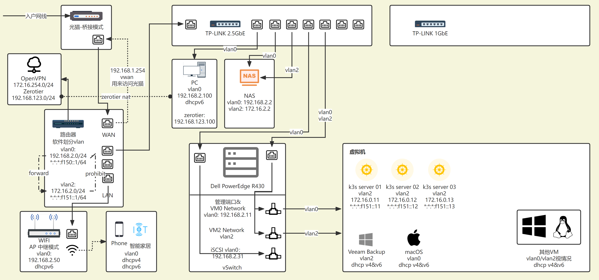
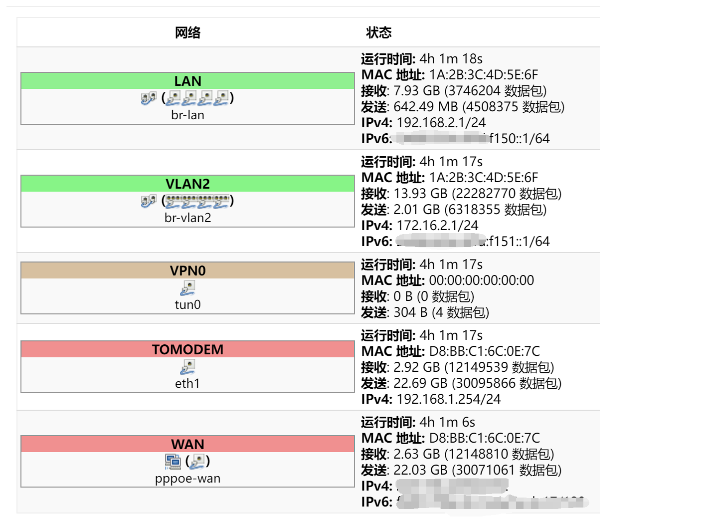

# 网络配置

路由器是选择的 J4125 工控机，自带 4 个 1GbE 网口，系统是自编译的 [Lean Lede]("https://github.com/coolsnowwolf/lede")

交换机选择了 TP-LINK 22 年新出的 8 口 2.5G 交换机，这是现在能买到的性价比最高的 2.5G 了，不带 VLAN 功能，我选择在路由器上做软件 VLAN  
还有一个 8 口 1G 的交换机，暂时没有用到 (2.5G 的还没插满)

老规矩先上网络拓扑图 (可能不太对，没好好学计算机网络):  


然后是openwrt接口图:  


---

从图中就可以大致看出我的所有配置了。

首先要解决桥接模式下无法访问光猫的问题，要用到静态路由。  
添加一个接口 tomodem，协议设置为静态地址，ipv4 地址为 192.168.1.254，不要配置dhcp，物理接口为 wan 口，防火墙区域为wan，然后设置一条 tomodem 的静态路由规则：
```
接口     对象         掩码             网关           跃点数  MTU   路由类型
tomodem  192.168.1.1  255.255.255.255  192.168.1.254  0       1500  unicast
```

我在子网中划分了两个vlan，分别是 192.168.2.0/24 和 172.16.2.0/24，ipv6 则是 \*:\*:\*:f150/64 和 \*:\*:\*:f151/64  
我的大部分物理设备，包括电脑，手机等等都在 vlan0 里边，而虚拟机及 k3s 集群则是在 vlan2 里边，这样做一是为了环境隔离，二是为了隔离广播域。  
再次说一下 openwrt 如何创建软件vlan，只需要在物理端口开启桥接，并在自定义端口中输入类似 eth0,2 这样的格式即可，如果有多个端口，一个一个添加即可。

然后要怎么样去解决服务访问的问题呢，我只想让 vlan0 去访问 vlan2 的服务，但不让 vlan2 去访问 vlan0 中的设备。这里要借助 openwrt 的防火墙。  
在防火墙中建立 vlan0，vlan2 两个区域，分别绑定到两个桥接端口中，luci 可以直接设置区域转发，设置一个从 vlan0 到 vlan2 的转发即可。或者也可以在通信规则中手动添加一条转发规则，并在静态路由中添加一条 vlan0 到 vlan2 的路由规则。

这时遇到了一个问题，我要在集群中用 NAS 做存储服务，但是 NAS 在vlan0 中，集群访问不到 NAS。最开始我的办法是添加了一条静态路由，172.16.2.0/24 -> 192.168.2.2，这样确实可以访问了，但是跨网段访问有风险和协议开销，于是我在 NAS 上额外插了一个网卡，并分配了 vlan2 的地址 172.16.2.2，这时 vlan0 和 vlan2 都可以访问到 NAS，而且也是隔离的。

现在的网络环境还有一个很大的问题，我现在只有一个 AP(WIFI)，是在 vlan0 网段的，一些智能设备，比如米家，是通过 wifi 去联网的，还有访客网络，这些设备也可以访问到我的私人设备，比如 PC，这是一个巨大的隐患，这些设备应该独立在自己的网段，不能与任何非 IOT 设备交互。等以后搬进新房的时候要解决，独立出一个 vlan-254-iot 网段，一个 vlan-253-guest 网段， 并且在 AP 上配置两个访客网络，一个供智能家居使用，另一个供访客使用，而且不与任何 vlan 网段做转发和路由。

---

接下来说一下 ESXi 的网络配置。

ESXi 的网络比较简单了，默认的 Management 和 VM Network 不动，VM Network 默认就是 vlan0。新建一个端口组，vlan id 设置为 2，这个是大部分 VM 要用到的端口。
考虑到吞吐量，iSCSI 单独用一个物理接口，新建一个 VMKernel 网卡，绑定到 iSCSI 接口，然后新建一个端口组绑定。在存储-适配器设置下添加软件 iSCSI 适配器，端口绑定到新建的 VMKernel即可。

